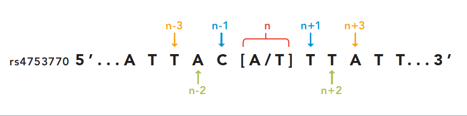

The Data Import Process
=======================

.. contents:: Table of Contents

When calling the ``make data`` step of SMARTER-database data generation, a series
of steps are performed in order to process raw data and to generate the final dataset.
This document tries to describe how the data import process works and how to add
new data to the SMARTER-database.

To add a new dataset into SMARTER-database, you need to call the following scripts
with specific option in ``data`` section of the ``Makefile``
file. The order in which those import scripts are called matters, since importing
a sample into SMARTER-database means generating a unique ``smarter_id``, which need
to be stable, in order to track the same object when updating the database or
in different releases. Scripts are written in order to be idempotent: calling the
same script twice with the same parameters will produce the same final result.

Defining a new dataset
----------------------

The data import process start by defining a dataset as a ``.zip`` archive, which could
contain *genotype* or *phenotype* information (or other metadata). Dataset can also
be classified as *foreground* or *background* respectively if they are generated
in the context of the *SMARTER* project or before it. Accordingly to data source
type and provenience, you have to define a record in the proper ``.csv`` file
in ``data/raw`` folder, like the following::

    #;File;Uploader;Size;Partner;Country;Species;Breed;N of Individuals;Gene Array;Chip Name
    3;ADAPTmap_genotypeTOP_20161201.zip;smarterdatabase-admin;43.68MB;AUTH;36 Countries;Goat;144 breeds;4653;Genotyping data in plink binary format;IlluminaGoatSNP50

Next, dataset need to be imported by calling ``src/data/import_datasets.py``
with the proper dataset type and input file, like the following example:

.. code-block:: bash

    python src/data/import_datasets.py \
        --types genotypes background \
        data/raw/genotypes-bg.csv

This command will add this dataset as a new
:py:class:`Dataset <src.features.smarterdb.Dataset>` object into the SMARTER-database
and will unpack its content in a folder with the *MongoDB* ``ObjectID`` inside the
``data/interim`` folder. This let you to analyze and process the dataset content
using the SMARTER-database ``src`` code. For more information, see the
:ref:`import_datasets.py <import_datasets>` help.

Exploring data with Jupyter Lab
-------------------------------

Before importing genotypes and samples into the SMARTER-database, there is an
additional *data exploration* step using Jupyter Lab: this step requires
manual intervention to understand if data could be imported as it is or if some
fixing steps are required. Common issues in datasets could
be having different breeds with the same code, or using different codes to specify
the same breeds. There could be the case where sample names within the genotype
file are different from the ones used in metadata: in all those cases, you have to define
a new metadata file where there will be a correspondence between the used value
and the value to be inserted into the SMARTER-database.

In this data exploration step, you could check also the coding format of genotypes,
by calling the proper :py:class:`SmarterMixin <src.features.plinkio.SmarterMixin>`
derived class. Metadata can also be integrated with external data sources,
which can be used to fix some stuff related to metadata. Start Jupyter Lab
(in an activated conda environment) with:

.. code-block:: bash

    jupyter lab

then create a new notebook according your needs. Those notebook can also be used
after the data ingestion to produce reports about the SMARTER-database status. Please, see the
`notebook section <https://drivendata.github.io/cookiecutter-data-science/#notebooks-are-for-exploration-and-communication>`__
in the `Cookiecutter Data Science <https://drivendata.github.io/cookiecutter-data-science/>`__
project for more information.

Adding breeds to the database
-----------------------------

Before upload samples into SMARTER-database, you have to register a
:py:class:`Breed <src.features.smarterdb.Breed>` first:
If the dataset have one or few breeds, you could define a new breed object by calling
:ref:`add_breed.py <add_breed>` like this:

.. code-block:: bash

    python src/data/add_breed.py --species_class sheep \
        --name Texel --code TEX --alias TEXEL_UY \
        --dataset TEXEL_INIA_UY.zip

where the ``--species_class`` parameter specifies the source species (*goat* or
*sheep*), ``--name`` and ``--code`` specify the breed
:py:class:`name <src.features.smarterdb.Breed.name>` and
:py:class:`code <src.features.smarterdb.Breed.code>` used in the
SMARTER-database respectively, the ``--alias`` specifies the FID (the *code*) used
in the genotype file and the ``--dataset`` parameter specifies the dataset
sources of the sample we want to add. If you have to manage many different breeds
in the same dataset, it's better to create breeds from a metadata file. In
such case, you can create your new breeds with a different script:

.. code-block:: bash

    python src/data/import_breeds.py --species_class Sheep \
        --src_dataset=ovine_SNP50HapMap_data.zip \
        --datafile ovine_SNP50HapMap_data/kijas2012_dataset_fix.xlsx \
        --code_column code --breed_column Breed \
        --fid_column Breed --country_column country

in such case, we will have a ``--src_dataset`` and ``--dst_dataset`` which let
to specify the dataset where the metadata information are retrieved (using the
``--datafile`` option) and the dataset where these information will be applied:
parameters like these can be provided to other import scripts which rely on
a metadata file and one or two distinct datasets.
The other parameters let to specify which columns of the metadata file will be
used when defining a new breed. See :ref:`import_breeds.py <import_breeds>`
documentation for more information.

.. note::

    Breed ``name`` and ``code`` are unique in the same species (enforced by MongoDB):
    if you have the same breed in two different dataset, you need to call those
    command twice: first time you will create a new
    :py:class:`Breed <src.features.smarterdb.Breed>` object with the alias used
    in the first dataset. Every other call on the same breed, will update the same
    object to support also the new alias in the other dataset.

Adding samples to the database
------------------------------

Samples can be added in two ways: the first is when converting data from genotype
files, the second is by processing metadata information. The first approach should
be used when you have a single breed in the whole genotype file, and the breed
``code`` in the genotype file have already a
:py:class:`Breed <src.features.smarterdb.Breed>` instance in the SMARTER-database:
this is the simplest data file, when data belongs to the same country and breed.
With this situation, you could create samples while processing the genotype
file simply by adding the ``--create-samples`` flag to the appropriate importing
script (for more information, see :ref:`Processing PLINK-like files`,
:ref:`Processing Illumina report files` and :ref:`Processing Affymetrix files` sections)

The second approach need to be used when you have different breeds in you genotype
file, or when there are additional information that can't be derived from the genotype
file, like the country of origin, the sample name or the breed codes which
could have different values respect to the values stored in the genotype file.
Other scenarios could be *Illumina report* or *Affymetrix report* files which don't
track the FID or other types of information outside sample names and genotypes.
Another case is when your genotype files contains more samples than metadata
file, for example, when you want to track in SMARTER-database only a few samples:
in all these cases, samples need to be created **before** processing genotypes,
using the :ref:`import_samples.py <import_samples>` script:

.. code-block:: bash

    python src/data/import_samples.py --src_dataset Affymetrix_data_Plate_652_660.zip \
        --datafile Affymetrix_data_Plate_652_660/Uruguay_Corriedale_ID_GenotypedAnimals_fix.xlsx \
        --code_all CRR --id_column "Sample Name" \
        --chip_name AffymetrixAxiomOviCan --country_all Uruguay \
        --alias_column "Sample Filename"

like :ref:`import_breeds.py <import_breeds>`, we have ``--src_dataset``
and ``--datafile`` to indicate where our metadata file is located; if our
genotype file is located in the same dataset of metadata, we can omit the
``--dst_dataset`` parameter. Breed codes and country can be set to the same values
with the ``--code_all`` or ``--country_all`` parameters, or can be read from metadata
file like the following example:

.. code-block:: bash

    python src/data/import_samples.py --src_dataset greece_foreground_sheep.zip \
        --dst_dataset AUTH_OVN50KV2_CHIOS_FRIZARTA.zip \
        --datafile greece_foreground_sheep/AUTH_OVN50KV2_CHIOS_FRIZARTA.xlsx \
        --code_column breed_code --id_column sample_name \
        --chip_name IlluminaOvineSNP50 --country_column Country

Please, look at :ref:`import_samples.py <import_samples>` help page to have more
info about the sample creation process.

.. note::

    Samples are always related to their source dataset, so you could have more
    samples with the same ``original_id`` in SMARTER-database. However, samples
    need to be unique in the same dataset, otherwise the genotype conversion
    step will not work. If your dataset contains two or more samples with the
    same ``original_id``, you could specify an additional column (like the ``alias``)
    to identify your samples within genotype files

Processing genotype files
-------------------------

Genotype data is not added into the SMARTER-database, however this data is validated
*with* SMARTER-database, which track information on SNPs: in fact, genotype data could be
produced long time ago and with different technologies, so assemblies don't match
and genotype calls need to be standardized in order to be compared. This is particularly
true when genotypes are referred according genomic sequence: since the chip probes
could be aligned to the *forward/reverse* strands, the same SNPs could have different
genotypes in different assembly versions. In such way, variants need to be converted
in order to compare datasets produced in different times with different approaches.
To accomplish this, variants need to be loaded into database from manifest, and supplementary
information need to be added into the smarter database: all those steps are managed
through ``Makefile`` by calling:

.. code-block:: bash

    make initialize

before importing datasets into the SMARTER-database. For more information, see
the :ref:`Loading variants into database` section of this documentation.

Converting genotypes to Illumina TOP
^^^^^^^^^^^^^^^^^^^^^^^^^^^^^^^^^^^^

All the received genotypes are converted in **illumina TOP** format: this coding
convention was introduced by Illumina and its main features is that SNP
orientation is determined from the sequence around the SNP itself. This seems
complex but has the advantage that the **SNPs remains the same even if the SNP
database or the genome assembly changes**. In detail, illumina defines as unambiguous
a SNP with only one of A or T calls: SNPs like A/G or A/C will be TOP snps;
SNP with T/C and T/G are BOTTOM SNPs. All the other ambiguous cases are determined
using the sequence walking method: starting from the SNPs itself, take a letter
after and before and check if the resulting pair is ambiguous or not. If the pair
is unambiguous, you can classify in TOP/BOTTOM. If the pair is ambiguous take
the second letter after and before the SNP and check the resulting pair.
This will be done until we can assign a TOP/BOTTOM coding to the SNP.

    Credits: `Illumina technical notes`_

In this example A/T is ambiguous even if is composed by A and T. The first
couple taken (T/C) is unambiguous so we can say that this example SNP is in BOTTOM orientation.
SMARTER genotypes are converted into Illumina TOP: this means that if a SNP is
already in TOP coding will be used as it is, but all the other cases need to be converted
into illumina TOP. The following is an example of coding conversion for
``DU186191_327.1`` SNP:

.. csv-table:: DU186191_327.1 A/G (unambiguous SNP)
    :file: _static/DU186191_327_to_top.csv
    :header-rows: 1

In the previous example is easy to convert a SNP into illumina TOP: assumed that the
TOP genotype is ``A/G``, every time a letter ``T`` or ``C`` is found it need to
be reversed. But how the snp ``OAR1_103790218.1`` can be converted?

.. csv-table:: OAR1_103790218.1 C/G (ambiguous SNP)
    :file: _static/OAR1_103790218_to_top.csv
    :header-rows: 1

This case is more complex since the ``C`` call is the complement of ``G``, so you can't
determine the coding of this genotype. The only way to determine the genotype coding
of this SNP is to check the coding of the other SNPs in the same dataset. The other
source of information required is the orientation of the probe to the reference genome.
Consider samples ``UYOA-CRR-000003890`` and ``GROA-CHI-000004137``: they have the
same TOP genotype since the probe is aligned to different strands in ``OAR3`` and ``OAR4``
assemblies, so only one genotype need to be reversed to get a TOP genotype. All the
information about SNP position and strand orientation are stored in
:py:class:`Variants <src.features.smarterdb.VariantSpecies>` and
:py:class:`Locations <src.features.smarterdb.Location>` objects, and can be
accessed using the proper methods. The genotype conversion is managed by the
proper :py:class:`SmarterMixin <src.features.plinkio.SmarterMixin>` derived class
method, called by the proper importing script.

So why convert genotypes into illumina TOP? Because illumina TOP SNPs are identical
in different genome assemblies, and this means that if you have a new genome
version you don't need to convert the genotype,
you will need only to update the genomic positions of the SNPs.
For such reason, each genotype importing script has a ``--coding`` option with
let you to specify the genotype coding of the source file. Source coding will be
checked against SMARTER-database :py:class:`variant <src.features.smarterdb.VariantSpecies>`
information in order to be converted in Illumina TOP coding.

To read more about illumina TOP/BOTTOM coding convention, please see
`illumina technical notes`_ documentation and also
`Simple guidelines for identifying top/bottom (TOP/BOT) strand and A/B allele <simple_guidelines>`_ and
`How to interpret DNA strand and allele information for Infinium genotyping array data <illumina_dna_strand>`_.

.. _`illumina technical notes`: https://www.illumina.com/documents/products/technotes/technote_topbot.pdf
.. _`illumina_simple_guidelines`: https://emea.support.illumina.com/bulletins/2016/06/simple-guidelines-for-identifying-topbottom-topbot-strand-and-ab-allele.html
.. _`illumina_dna_strand`: https://emea.support.illumina.com/bulletins/2017/06/how-to-interpret-dna-strand-and-allele-information-for-infinium-.html

Processing PLINK-like files
^^^^^^^^^^^^^^^^^^^^^^^^^^^

Genotypes provided as `PLINK <https://www.cog-genomics.org/plink/1.9/>`__ files
(both *text* or *binary*) can be imported using the :ref:`import_from_plink.py <import_from_plink>`
script, like in the following example:

.. code-block:: bash

    python src/data/import_from_plink.py --bfile AUTH_OVN50KV2_CHIOS_FRIZARTA/AUTH_OVN50KV2_CHI_FRI \
        --dataset AUTH_OVN50KV2_CHIOS_FRIZARTA.zip --coding forward \
        --chip_name IlluminaOvineSNP50 --assembly OAR3

The ``--bfile/--file`` options (mutually exclusive) let you to specify a file prefix
(like PLINK does) for a binary/text file respectively. The ``--dataset`` option
lets to specify which dataset contains the genotype file; ``--coding`` option lets
to specify the source coding (if the provided coding does not match with database data,
the import process will fail). The ``--assembly`` parameter will be the destination
assembly version of the converted genotypes. There are also other parameter, for
example when you have source genotypes with *rs_id* or when the source assembly
is different from the destination assembly. For a full list os such options,
take a look to :ref:`import_from_plink.py <import_from_plink>` help page.

Processing Illumina report files
^^^^^^^^^^^^^^^^^^^^^^^^^^^^^^^^

Genotypes provided as Illumina reports need to be processed using another script:

.. code-block:: bash

    python src/data/import_from_illumina.py --report JCM2357_UGY_FinalReport1.txt \
        --snpfile OvineHDSNPList.txt --dataset CREOLE_INIA_UY.zip --breed_code CRL \
        --chip_name IlluminaOvineHDSNP --assembly OAR3 --create_samples

In this case the Illumina report file need to be specified with the ``--report``
option, while the SNPs information file need to be specified with the ``--snpfile``
option. This command, like :ref:`import_from_plink.py <import_from_plink>` and
:ref:`import_from_affymetrix.py <import_from_affymetrix>` let to create samples
while reading from genotypes using the ``--create_samples`` flag. Since illumina
report files doesn't track information about FID, breed codes need to be specified
using ``--breed_code`` parameter only for one breed samples file: files with multiple
breeds can't be imported like this, samples need to be created before with
:ref:`import_samples.py <import_samples>` in order to retrieve the correct
information from SMARTER-database. Please see
:ref:`import_from_illumina.py <import_from_illumina>` manual pages to get other
information regarding this program.

Processing Affymetrix files
^^^^^^^^^^^^^^^^^^^^^^^^^^^

Affymetrix genotypes can be provided using reports format or PLINK like format
(which lacks of some columns unlike standard PLINK files). Even in this case,
there will be a proper script to call and custom parameters to specify:

.. code-block:: bash

    python src/data/import_from_affymetrix.py \
        --prefix Affymetrix_data_Plate_652_660/Affymetrix_data_Plate_652/Affymetrix_data_Plate_652 \
        --dataset Affymetrix_data_Plate_652_660.zip --breed_code CRR --chip_name AffymetrixAxiomOviCan \
        --assembly OAR3 --sample_field alias --src_version Oar_v4.0 --src_imported_from affymetrix

In this example, the ``--prefix`` parameter means load data from a PLINK-like
file. The other input source type could be specified with the ``--report`` option.
Other parameters are already been described with other import script, with the
exception of ``--sample_field``, which let to search samples using a different
attribute, and the source of the assembly (both ``--src_version`` and
``--src_imported_from``) which is required to convert genotypes into Illumina
TOP. For other information, please see the :ref:`import_from_affymetrix.py <import_from_affymetrix>`
help page.

Adding metadata information
---------------------------

Next step in the data import pipeline is importing metadata into SMARTER-database:
those data can't be provided in the final genotype file, and so will be made available
through the `SMARTER-backend <https://webserver.ibba.cnr.it/smarter-api/docs/>`__
with the help of the `r-smarter-api <https://cnr-ibba.github.io/r-smarter-api/>`__
R package and `SMARTER-frontend <https://webserver.ibba.cnr.it/smarter/>`__.
There are two main scripts to import metadata:
:ref:`import_metadata.py <import_metadata>` and :ref:`import_phenotypes.py <import_phenotypes>`.
:ref:`import_metadata.py <import_metadata>` should be used to import GPS coordinates
and other generic metadata fields, while :ref:`import_phenotypes.py <import_phenotypes>`
should be used to import phenotypes. Both two scripts can be used to apply information
to all the samples belonging to the same breed or to each
sample belonging to the same datasets, relying on metadata defined for each
breed group or each distinct sample. For example, to load data with GPS coordinates
and additional columns you can call :ref:`import_metadata.py <import_metadata>`
like this:

.. code-block:: bash

    python src/data/import_metadata.py --src_dataset "High density genotypes of French Sheep populations.zip" \
        --datafile Populations_infos_fix.xlsx --breed_column "Population Name" \
        --latitude_column Latitude --longitude_column Longitude --metadata_column Link \
        --metadata_column POP_GROUP_CODE --metadata_column POP_GROUP_NAME

In this example, metadata are applied by breed using the ``--breed_column``.
Parameters like ``--src_dataset/--dst_dataset`` and ``--dataset`` have the same
behavior described in :ref:`import_samples.py <import_samples>`. All the additional
metadata column can be loaded by calling multiple times the ``--metadata_column``
parameter by providing the desired column in metadata file. Similarly, this
applies also for :ref:`import_phenotypes.py <import_phenotypes>` as described
in the following example:

.. code-block:: bash

    python src/data/import_phenotypes.py --src_dataset ADAPTmap_phenotype_20161201.zip \
    --dst_dataset ADAPTmap_genotypeTOP_20161201.zip \
    --datafile ADAPTmap_phenotype_20161201/ADAPTmap_InfoSample_20161201_fix.xlsx --id_column ADAPTmap_code \
    --chest_girth_column ChestGirth --height_column Height --length_column Length \
    --additional_column FAMACHA --additional_column WidthOfPinBones

This time, phenotype metadata are loaded for each sample, as described by the
``--id_column`` parameter. Then there are parameters which describe a single
phenotype trait, like ``--height_column`` or ``--length_column``, while additional
phenotype traits not described by the :py:class:`Phenotype <src.features.smarterdb.Phenotype>`
class, can be loaded with the ``--additional_column`` parameter, which can be
specified multiple times.

Merging datasets together
-------------------------

Last step of data import is merging all the processed genotype files into one
dataset for species/assemblies. You can do it by calling :ref:`merge_datasets.py <merge_datasets>`
like this:

.. code-block:: bash

    python src/data/merge_datasets.py --species_class sheep --assembly OAR3

This script will search all processed genotype files for the same species/assembly
and will merge all the genotypes in one file. The final genotype will be placed
in a new directory with the same name of the desired assembly under the ``data/processed``
directory.
